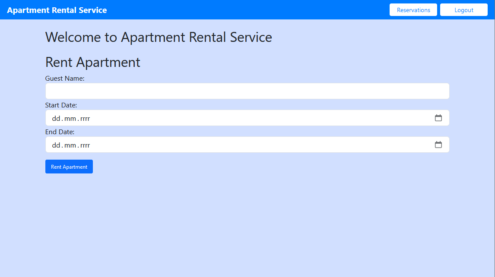

           # Apartment Rental Service

Apartment Rental Service is a web application developed using Spring Boot. It allows users to register, log in, list apartments for rent, rent an apartment for a specific range of dates, and edit their bookings.

## Features
The application provides the  REST methods and services for managing apartments and bookings:
- User registration and login: New users can create an account and log in.
- List Apartment: Registered users can see a list of apartments for rent.
- Rent Apartment: Registered users can rent an apartment for a specific period.
- Edit Booking: Users can edit their booking details or delete the booking.
- Add Apartment: User with admin role can add new apartments.

## Technologies Used

- Java
- Spring boot
- Maven
- JSON Web Token
- Angular (front-end part)

## Front-end code
https://github.com/aleksanderinglot/angular-apartment-rental-service

## Getting Started

These instructions will get you a copy of the project up and running on your local machine for development and testing purposes.

### Prerequisites

- Java version 17 or later
- Maven
- MySQL

### Installing and Running

1. Clone the repo: `git clone https://github.com/aleksanderinglot/apartment-rental-service.git`
2. Navigate to the project directory: `cd apartment-rental-service`
3. Set up your MySQL database. You will need to create a database and configure the `application.properties` file in the project to use this database.
4. Install dependencies: `mvn install`
5. Run the project: `mvn spring-boot:run`

## Screenshots

  
  
 
  
 
  

